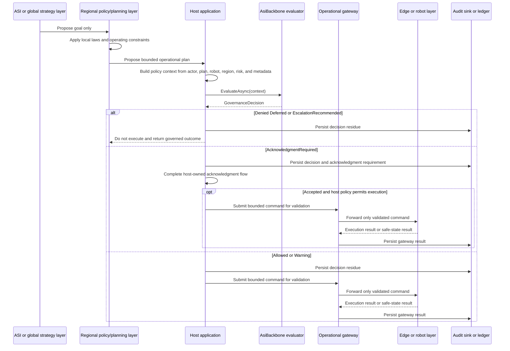

# Robotics Operational Gateway Scenario

Robotics and other physical-control endpoints are useful future examples for the AsiBackbone governance pattern because they show why consequential actions should pass through explicit policy, acknowledgment, audit, and capability boundaries before physical execution.

This page describes a **future or advanced integration scenario**. It is not a claim that the current AsiBackbone package family controls robots, issues robot commands, or provides a robotics runtime.

> [!IMPORTANT]
> Direct ASI-to-robot control is not supported or recommended. In this scenario, an ASI or global strategy layer may propose goals only. A regional or local policy/planning layer, operational gateway, and edge safety layer must stand between global intent and physical execution.

## Scenario boundary

The current AsiBackbone packages provide governance-oriented primitives and host integration seams. They do not provide robotics SDKs, motion planning, hardware drivers, real-time safety certification, autonomous-vehicle controls, drone controls, industrial robot controls, or physical emergency-stop systems.

A robotics package, if added later, should remain an integration layer around host-owned robotics infrastructure rather than a replacement for safety-certified robot-control systems.

## Control path

A safe robotics integration should avoid direct global-to-edge command flow.

```text
ASI or global strategy layer
  -> goals only, signed and auditable
Regional policy/planning layer
  -> applies local laws, policies, cultural constraints, and operating rules
Operational gateway
  -> validates capability, geofence, rate limits, time-bound tokens, and safety checks
Edge or robot layer
  -> executes only validated commands and keeps independent safety governors
```

The same pattern can also apply to other external systems where an action leaves the software boundary and affects people, infrastructure, equipment, money, credentials, legal status, or physical space.

## Responsibility boundary

| Participant | Responsibility |
| --- | --- |
| ASI or global strategy layer | Sends high-level goals or optimization targets only. It does not issue direct robot commands. |
| Regional policy/planning layer | Converts goals into local, lawful, bounded plans using regional policy, licensing, environmental, and cultural constraints. |
| Host application | Owns the policy context, actor context, robotics integration, user experience, authorization, and final execution decision. |
| AsiBackbone | Evaluates host-provided context through constraints and decision policy, then returns a governance decision and audit-ready residue. |
| Operational gateway | Validates proposed actions against robot capability, location, rate limits, command grammar, token scope, and fail-closed rules. |
| Edge or robot layer | Executes only validated commands and retains independent, non-overridable safety governors. |
| Human operator or safety system | Provides out-of-band supervision, interlock, or emergency stop where required by the physical system. |

## Sequence



## Regional policy enforcement

A robotics scenario depends heavily on regional policy because physical execution is local.

Examples of regional or local constraints include:

- Workplace safety rules.
- Drone, vehicle, or robotics licensing rules.
- Geofencing and restricted operating zones.
- Time-of-day restrictions.
- Force, speed, proximity, payload, or tool-use limits.
- Human supervision requirements.
- Emergency, disaster, school, healthcare, or public-space restrictions.
- Cultural or institutional rules for acceptable automation behavior.

A global strategy such as "increase facility throughput" or "improve agricultural yield" should not become robot motion by itself. The regional layer must translate the goal into locally valid, bounded plans before any operational gateway receives a command.

## Operational gateway checks

The operational gateway is the last software-side safety filter before an external or physical system.

Typical gateway checks include:

- Command grammar validation.
- Robot or endpoint identity validation.
- Capability-token validation.
- Token scope, expiration, issuer, and audience checks.
- Geofence validation.
- Rate limits and cooldown windows.
- Capability limits such as speed, force, payload, tool, zone, or duration.
- Required operator, supervisor, or acknowledgment state.
- Firmware, configuration, or attestation checks where the host environment supports them.
- Fail-closed handling when any required signal is missing.

A useful rule is:

```text
No valid policy decision, no valid token, no valid gateway check, no physical command.
```

## Simulated command-validation example

The following example is intentionally simulated. It demonstrates the shape of a host-owned validation flow without claiming that AsiBackbone currently provides robot-control functionality. The `SimulatedGatewayResult` and `SimulatedRobotGateway` types represent host-defined placeholders, not current AsiBackbone API types.

```csharp
IReadOnlyDictionary<string, string> metadata = new Dictionary<string, string>(StringComparer.Ordinal)
{
    ["scenario"] = "robotics-operational-gateway",
    ["region"] = "us-la",
    ["operation"] = "robot.move",
    ["robot.id"] = "sim-robot-001",
    ["robot.zone"] = "warehouse-zone-a",
    ["risk"] = "high",
    ["command.speed"] = "0.25m/s",
    ["command.maxForce"] = "10N"
};

var context = new AsiBackboneConstraintEvaluationContext(
    correlationId: correlationId,
    policyVersion: "robotics-simulation-v1",
    policyHash: policyHash,
    metadata: metadata);

GovernanceDecision decision = await evaluator.EvaluateAsync(
    context,
    cancellationToken);
```

The host can then refuse physical execution unless the governance decision and gateway checks both pass.

```csharp
if (decision.Outcome is GovernanceDecisionOutcome.Denied
    or GovernanceDecisionOutcome.Deferred
    or GovernanceDecisionOutcome.EscalationRecommended)
{
    await auditSink.WriteAsync(
        AuditResidue.FromDecision(actor, "robot.move", decision, metadata: metadata),
        cancellationToken);

    return SimulatedGatewayResult.FailClosed("Governance decision did not permit execution.");
}

if (decision.Outcome == GovernanceDecisionOutcome.AcknowledgmentRequired)
{
    return SimulatedGatewayResult.FailClosed("Acknowledgment must be completed before execution.");
}

SimulatedGatewayResult gatewayResult = SimulatedRobotGateway.Validate(
    robotId: "sim-robot-001",
    capabilityToken: token,
    geofence: "warehouse-zone-a",
    commandVerb: "move",
    maxSpeedMetersPerSecond: 0.25,
    maxForceNewtons: 10,
    expiresAt: expiresAt);

if (!gatewayResult.Allowed)
{
    return gatewayResult;
}

// Only host-owned robotics code would execute from here.
// AsiBackbone has evaluated governance context, but it has not controlled the robot.
```

In a production physical-control environment, the simulated gateway above would need to be replaced by safety-certified, domain-specific robotics infrastructure, independent hardware safety controls, and operational procedures appropriate to the system being controlled.

## Benefits

This pattern provides several benefits when used carefully:

| Benefit | What it means |
| --- | --- |
| Legal and local policy enforcement | Regional constraints can prevent globally proposed goals from becoming locally unlawful actions. |
| Risk containment | A bad plan or failed validation can be contained at the regional, host, or gateway layer before reaching physical execution. |
| Cultural and regional adaptation | Automation behavior can respect local expectations, institutional rules, public-space norms, and operating context. |
| Policy agility | Regional policy can change without requiring a global command model to understand every local rule. |
| Fail-closed behavior | Missing context, missing tokens, expired grants, invalid geofences, or unsupported commands result in no execution. |
| Auditability | Decisions and gateway outcomes can preserve reason codes, policy versions, correlation IDs, and command metadata. |

## What this pattern prevents

A robotics operational gateway helps avoid high-risk integration mistakes:

- Allowing global strategy to become direct physical command.
- Treating model output as robot execution authority.
- Bypassing regional laws, licensing, or site-specific operating rules.
- Giving robots broad, long-lived authority instead of scoped and time-bound grants.
- Logging only after the robot has already acted.
- Depending on prompt text instead of machine-checkable command envelopes.
- Treating software acknowledgment as a substitute for physical safety systems.

## Adoption note

Robotics should remain a later integration package or advanced scenario. A good first validation is a simulated command gateway that never touches hardware. The host should prove policy evaluation, acknowledgment flow, audit residue, capability-token scope, and fail-closed behavior before connecting the pattern to any external system.

## Related documentation

- [AI Agent Gateway Scenario](ai-agent-gateway.md)
- [Policy Evaluator Pipeline](../policy-evaluator-pipeline.md)
- [Adoption and Target Use Cases](../use-cases.md)
- [ASP.NET Core Integration Boundary](../aspnetcore-integration-boundary.md)
- [Plain ASP.NET Core Host Sample](../plain-aspnetcore-host-sample.md)
